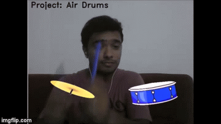

### [View a detailed tutorial](Tutorial.md)
### [View Video](https://www.youtube.com/watch?v=vsIh6W8XdUE)
 

Augmented reality drums based on concepts of computer vision and image processing. 
A fun application created to enable users to play virtual drums anywhere simply by using
colour tags. I used HSV based color segmentation method to detect blue color. For playing the drum I have used pygames.

>- You can use it for entertainment or can learn some key functions of opencv from this code. 
>- Refer a detailed [Tutorial](Tutorial.md) explaining the [code](Air_Drums.py).

---

## Installation

#### Clone

- Clone this repo to your local machine using `https://github.com/kaustubh-sadekar/AIR_Drums.git`

#### Setup/Requirements

> The code is written in Python (`Python3`)
> You need the following libraries
> - numpy
> - matplotlib
> - OpenCV
> - pygame

---

##### Refer the [Tutorial](Tutorial.md) for detailed explaination of the code.

## License

- **[MIT license](http://opensource.org/licenses/mit-license.php)**
