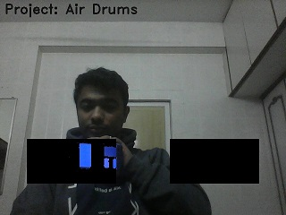
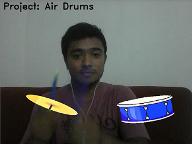

# AIR_Drums Project Tutorial

This tutorial aims at explaining some key concepts of `image processing` using `opencv` with python.
We will try to understand each line of the [code](Air_Drums.py)

> ###### Note for someone using python for the first time:
> anything written after '#' will be treated as a comment 
> it is a good practice to add comments in your code. 
> It makes the code easy to understand.

---

#### Importing all the required libraries 
```python

# Importing the libraries 
import numpy as np
import time
import cv2
from pygame import mixer

````

####  Initializing variables and creating objects

```python

Verbsoe = True

# importing the audio files
mixer.init()
drum_clap = mixer.Sound('batterrm.wav')
drum_snare = mixer.Sound('button-2.ogg')

```

Here `verbose` is a Boolean that you can set to visualise the processing 
in the ROI (Region of interest)

verbose = True | with verbose = False
--- | ---
 | 


#### Setting the HSV colour range to detect blue colour

```python

# HSV range for detecting blue colour 
blueLower = (80,150,50)
blueUpper = (120,255,255)
```
With the above lines we set the values to detect the blue colour. 
These values will be used in the [creating mask](# creating mask ) to find 
`pixels corresponding to blue colour inside the ROI.`


#### Capturing frames from camera and determining the frame size. 

```python
# Frame accusation from webcam/ usb camera 
camera = cv2.VideoCapture(0)
ret,frame = camera.read()

# Determining the frame resolution (height,width)
H,W = frame.shape[:2]
```


#### Reading the images of instruments to be augmented with fixed size (200,100)

```python
# reading the image of hatt and snare for augmentation.
Hatt = cv2.resize(cv2.imread('Hatt.png'),(200,100),interpolation=cv2.INTER_CUBIC)
Snare = cv2.resize(cv2.imread('Snare.png'),(200,100),interpolation=cv2.INTER_CUBIC)
```
> to read an image the syntax is cv2.imread("path of the image")
> to reshape the image as per desired shape we use cv2.resize(image,(width,heigh),interpolation=INTERPOLATION_METHOD_FLAG_VALUE)
The size for augmenting the objects is decided based on the ROI.


#### Setting the ROI parameters (Region of interest)
The region of interest is the black colour portion in the image below


**Why ROI is needed?**

Answer is **Speed**.
To detect blue colour we need to perform certain operations on each captured frame. 
`These operations need some computations to be performed by the processor`.
Since our instruments are fixed in this application and we want to play the sound only
if the blue colour object hits the instrument (`detected inside the ROI`) it is a good idea
to perform all these operations only inside the ROI. 

With the below lines of code we calculate the top left and bottom right corners of the ROI 
corresponding to both the instruments *Hatt and Snare*. 
```python
# Setting the corners of ROI for blue colour detection
Hatt_center = [np.shape(frame)[1]*2//8,np.shape(frame)[0]*6//8]
Snare_center = [np.shape(frame)[1]*6//8,np.shape(frame)[0]*6//8]
Hatt_thickness = [200,100]
Hatt_top = [Hatt_center[0]-Hatt_thickness[0]//2,Hatt_center[1]-Hatt_thickness[1]//2]
Hatt_btm = [Hatt_center[0]+Hatt_thickness[0]//2,Hatt_center[1]+Hatt_thickness[1]//2]

Snare_thickness = [200,100]
Snare_top = [Snare_center[0]-Snare_thickness[0]//2,Snare_center[1]-Snare_thickness[1]//2]
Snare_btm = [Snare_center[0]+Snare_thickness[0]//2,Snare_center[1]+Snare_thickness[1]//2]
```


#### Inside the while loop....
capture camera frame and store it in a numpy array.
```python
ret, frame = camera.read()
```

Flip the image so the output is a mirror image of yours
```pyhton 
frame = cv2.flip(frame,1)
```

Selecting the ROI corresponding to Snare and Hatt.
ROI is selected by indexing the rows and columns of the image frame.
```python 
img[a:b,c:d] 
```
The above line is an example how you can index rows from a to b of columns c to d 
of the image stored as a numpy array `img`.

Using this concept we use the ROI parameters that we set initially to select corresponding ROI.
```python
# Selecting ROI corresponding to snare
snare_ROI = np.copy(frame[Snare_top[1]:Snare_btm[1],Snare_top[0]:Snare_btm[0]])
mask = ROI_analysis(snare_ROI,1)

# Selecting ROI corresponding to Hatt
hatt_ROI = np.copy(frame[Hatt_top[1]:Hatt_btm[1],Hatt_top[0]:Hatt_btm[0]])
mask = ROI_analysis(hatt_ROI,2)
```

###### Creating the output to be displayed
The code show below is responsible for creating the final augmented frame that you see on the screen as output.
```python

# A writing text on an image.
cv2.putText(frame,'Project: Air Drums',(10,30),2,1,(20,20,20),2)

# A writing text on an image.
cv2.putText(frame,'Project: Air Drums',(10,30),2,1,(20,20,20),2)

# Display the ROI to view the blue colour being detected
  if Verbsoe:
    	frame[Snare_top[1]:Snare_btm[1],Snare_top[0]:Snare_btm[0]] =    cv2.bitwise_and(frame[Snare_top[1]:Snare_btm[1],Snare_top[0]:Snare_btm[0]],frame[Snare_top[1]:Snare_btm[1],
      Snare_top[0]:Snare_btm[0]], mask=mask[Snare_top[1]:Snare_btm[1],Snare_top[0]:Snare_btm[0]])
    	frame[Hatt_top[1]:Hatt_btm[1],Hatt_top[0]:Hatt_btm[0]] = cv2.bitwise_and(frame[Hatt_top[1]:Hatt_btm[1],Hatt_top[0]:Hatt_btm[0]],frame[Hatt_top[1]:Hatt_btm[1],Hatt_top[0]:Hatt_btm[0]],
      mask=mask[Hatt_top[1]:Hatt_btm[1],Hatt_top[0]:Hatt_btm[0]])
    
    # Augmenting the instruments in the output frame.
    else:
    	# Augmenting the image of the instruments on the frame.
    	frame[Snare_top[1]:Snare_btm[1],Snare_top[0]:Snare_btm[0]] = cv2.addWeighted(Snare, 1, frame[Snare_top[1]:Snare_btm[1],Snare_top[0]:Snare_btm[0]], 1, 0)
    	frame[Hatt_top[1]:Hatt_btm[1],Hatt_top[0]:Hatt_btm[0]] = cv2.addWeighted(Hatt, 1, frame[Hatt_top[1]:Hatt_btm[1],Hatt_top[0]:Hatt_btm[0]], 1, 0)

```
Do not be scared by the long lines of code. It simply looks complicated but is very easy. 
To understand the above code lets break it down into what it is doing.
- Accessing the pixels, of the original frame, inside the corresponding ROI and changing their values. This is done by 
>frame[a:b,c:d] where a,b,c and d are the desired values for corresponding ROI.
- What values to be assigned to the pixels ?? That is what helps us to achieve the augmentation.
> In case of verbose = True, we set the pixel values equal to the ROI with blue pixels being displayed.
> `cv2.bitwise_and(image,image,mask=bin_mask)` this step makes pixels values = 0 for region where 
> mask=0 and rest of the image is unchanged. 
> In case of verbose = False, we use the cv2.addWeighted() function of opencv to augment the 
> instruments in the output frame.


finally we display the output by `cv2.imshow()`

#### Understanding the ROI analysis function
Frame corresponding ROI is cropped and passed to the function which performs all the operations to detect blue 
colour pixels in it. We use HSV colour space to detect the presence of blue colour. 

```python
def ROI_analysis(frame,sound):
	

	# converting the image into HSV
	hsv = cv2.cvtColor(frame, cv2.COLOR_BGR2HSV)
	
  # generating mask for pixels corresponding to detected blue colour.
	mask = cv2.inRange(hsv, blueLower, blueUpper)
	
	# Calculating the number of white pixels depecting the blue colour pixels in the ROI
	sumation = np.sum(mask)
	
	# Function that decides to play the instrument or not.
	state_machine(sumation,sound)

	
return mask
```

#### Finall how is the sound being played ....
The function compares the total number of detected blue pixels with a threshold 
and if the sum is larger than threshold the corresponding sound is 
played by the line `drum_clap.play()` or `drum_snare.play().

```python
def state_machine(sumation,sound):

	# Check if blue color object present in the ROI 	
	yes = (sumation) > Hatt_thickness[0]*Hatt_thickness[1]*0.8

	# If present play the respective instrument.
	if yes and sound==1:
		drum_clap.play()
		
	elif yes and sound==2:
		drum_snare.play()
time.sleep(0.001)

```
